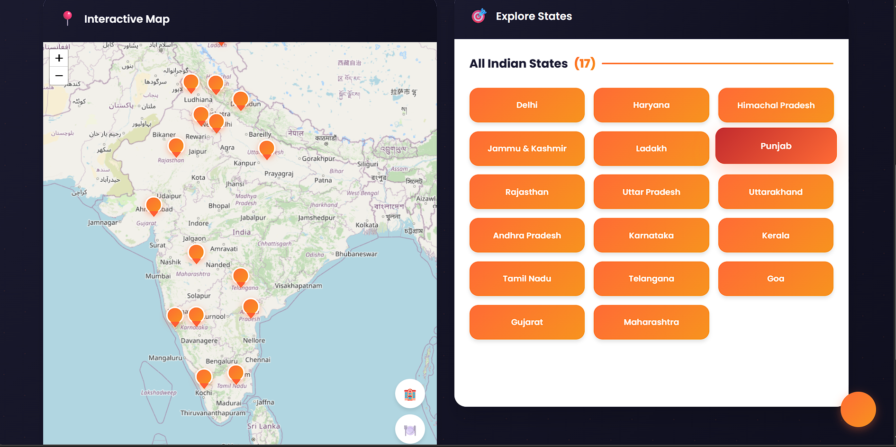
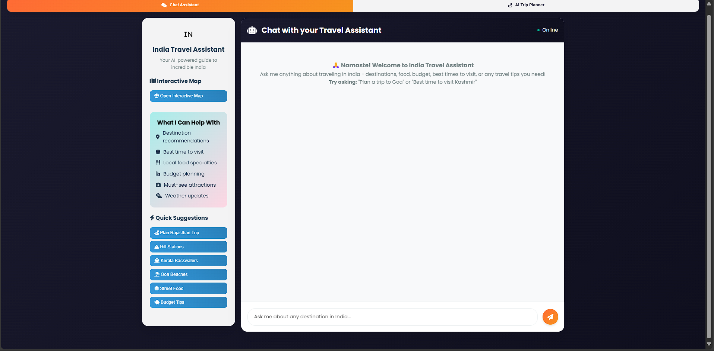
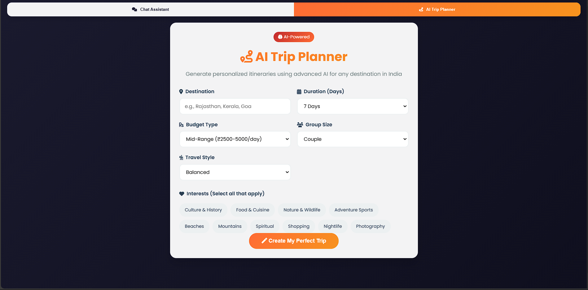
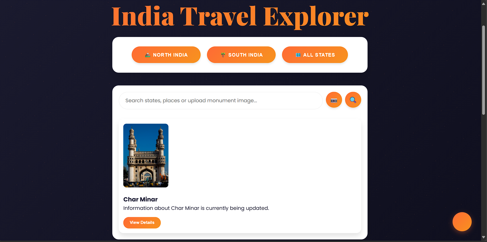

# India Travel Explorer 🇮🇳

A comprehensive web application for exploring India's rich travel destinations, featuring an interactive map, AI-powered travel assistant, and monument recognition capabilities.

## 🌟 Features

### 🗺️ Interactive Travel Explorer
- **Dynamic Map**: Interactive map of India with state markers using Leaflet.js
- **Region Filtering**: Filter states by North India, South India, or view all
- **State Profiles**: Detailed information for each Indian state including:
  - Tourist attractions and highlights
  - Local cuisine and cultural insights
  - Best time to visit recommendations
  - Transportation and accommodation options
- **Tourist Place Details**: Comprehensive information with image galleries, entry fees, timings, and nearby amenities
- **Nearby Services**: Find hospitals, gas stations, ATMs, shopping malls, transport hubs, and more

### 🤖 AI Travel Assistant
- **Smart Chat Interface**: Context-aware conversational AI for travel planning
- **Real-time Information**: Weather updates, destination images, and personalized recommendations
- **Quick Suggestions**: Pre-built query buttons for common travel questions
- **Trip Planner**: Generate comprehensive itineraries with:
  - Day-by-day activity plans
  - Budget breakdowns and cost estimates
  - Accommodation recommendations
  - Packing essentials and travel tips
  - Weather-based clothing suggestions
  - Local cultural insights and language phrases

### 🏛️ Monument Recognition
- **Image Upload**: Upload photos of Indian monuments
- **AI Recognition**: Powered by Roboflow API for accurate monument identification
- **Detailed Information**: Historical significance, visiting hours, and location details

## 🚀 Technology Stack

### Backend
- **Framework**: Flask (Python)
- **Database**: MongoDB
- **AI Integration**: Groq API with LLaMA 3 8B model
- **APIs**: 
  - OpenWeather API for weather data
  - Unsplash API for destination images
  - Roboflow API for monument recognition
  - Spotify API for music recommendations

### Frontend
- **Map Library**: Leaflet.js
- **Styling**: Custom CSS with gradient themes
- **Fonts**: Poppins and Playfair Display
- **Icons**: Font Awesome and Emoji
- **Responsive Design**: Mobile-first approach
- 
## 🖼️ Screenshots

### 🏠 Home Page


### 🗺️ Interactive Map View


### 💬 AI Travel Assistant Chat


### 🧳 Trip Planner


### 🏛️ Monument Recognition


## 📋 Prerequisites

- Python 3.8+
- MongoDB
- API Keys for:
  - Groq API
  - OpenWeather API
  - Unsplash API
  - Roboflow API
  - Spotify API

## 🔧 Installation

1. **Clone the repository**
   ```bash
   git clone https://github.com/varun339658/travel_new_website.git
   cd india-travel-explorer
   ```

2. **Install dependencies**
   ```bash
   pip install -r requirements.txt
   ```

3. **Set up environment variables**
   Create a `.env` file in the root directory:
   ```env
   # API Keys
   GROQ_API_KEY=your_groq_api_key
   UNSPLASH_ACCESS_KEY=your_unsplash_access_key
   OPENWEATHER_API_KEY=your_openweather_api_key
   SPOTIFY_API_KEY=your_spotify_api_key
   
   # Secret Key
   SECRET_KEY=your_secret_key_here
   
   # MongoDB
   MONGODB_URI=your_mongodb_connection_string
   
   # Roboflow API Info
   ROBOFLOW_API_KEY=your_roboflow_api_key
   ROBOFLOW_PROJECT_NAME=your_project_name
   ROBOFLOW_WORKSPACE=your_workspace_name
   ROBOFLOW_VERSION=your_model_version
   ```

4. **Set up MongoDB**
   - Install MongoDB locally or use MongoDB Atlas
   - Import the states and tourist places data

5. **Run the application**
   ```bash
   python app.py
   ```

6. **Access the application**
   Open your browser and navigate to `http://localhost:5000`

## 🔒 Security Note

**Important**: Never commit your `.env` file to version control. Make sure to add it to your `.gitignore` file:

```gitignore
.env
*.env
__pycache__/
*.pyc
.DS_Store
node_modules/
```

## 🗂️ Project Structure

```
india-travel-explorer/
├── app.py                 # Main Flask application
├── static/
│   ├── css/
│   │   └── style.css     # Main stylesheet
│   ├── js/
│   │   └── script.js     # Frontend JavaScript
│   └── images/           # Static images
├── templates/
│   └── index.html        # Main HTML template
├── data/
│   ├── states.json       # States data
│   └── tourist_places.json # Tourist places data
├── .env                  # Environment variables (DO NOT COMMIT)
├── .gitignore           # Git ignore file
├── requirements.txt      # Python dependencies
└── README.md            # This file
```

## 🔌 API Endpoints

### Core Endpoints
- `GET /api/stats` - Application statistics
- `GET /states/<region>` - States by region (north/south)
- `GET /api/all-states` - All states data
- `GET /api/state/<state_name>` - Specific state information
- `GET /api/tourist-place` - Tourist place details
- `POST /api/message` - Chat with AI assistant
- `POST /api/plan-trip` - Generate trip itinerary
- `POST /predict` - Monument recognition

## 🎨 Design Features

- **Color Scheme**: Vibrant orange-coral gradients (#FF6B35 to #F7931E) on dark theme
- **Typography**: Modern Poppins and elegant Playfair Display fonts
- **Animations**: Smooth transitions and hover effects
- **Responsive Layout**: Optimized for all device sizes
- **Interactive Elements**: Dynamic markers, image galleries, and tabbed interfaces

## 🔄 User Journeys

### Explorer Flow
1. View interactive India map with state markers
2. Filter by regions or explore all states
3. Click states for detailed information
4. Explore tourist places within states
5. Find nearby amenities and services

### AI Assistant Flow
1. Switch to chat interface
2. Ask travel-related questions
3. Receive AI-powered responses with images and weather
4. Use quick suggestion buttons for common queries

### Trip Planner Flow
1. Enter destination and travel preferences
2. Generate comprehensive itinerary
3. Explore day-by-day plans and budget breakdowns
4. Get packing lists and travel tips

### Monument Recognition Flow
1. Upload monument photo
2. Get AI-powered identification
3. Explore monument details and location info

## 🔧 Performance Features

- **Caching System**: Response caching for improved performance
- **Rate Limiting**: Protection against excessive API usage
- **Error Handling**: Comprehensive fallback mechanisms
- **Optimized Loading**: Dynamic content loading without page reloads
- **Database Connection Management**: Connection pooling and retry logic

## 🤝 Contributing

1. Fork the repository
2. Create a feature branch (`git checkout -b feature/AmazingFeature`)
3. Commit your changes (`git commit -m 'Add some AmazingFeature'`)
4. Push to the branch (`git push origin feature/AmazingFeature`)
5. Open a Pull Request

## 📄 License

This project is licensed under the MIT License - see the [LICENSE](LICENSE) file for details.

## 🙏 Acknowledgments

- **APIs**: Thanks to Groq, OpenWeather, Unsplash, Roboflow, and Geoapify
- **Mapping**: Leaflet.js for interactive maps
- **Data**: Indian tourism and cultural information sources
- **Icons**: Font Awesome and Emoji contributors

## 📞 Support

For support, please open an issue on GitHub or contact [mandadivarunreddy339658@gmail.com](mailto:mandadivarunreddy339658@gmail.com)
.

---

**Made with ❤️ for exploring Incredible India**
# India-Travel-Explorer
